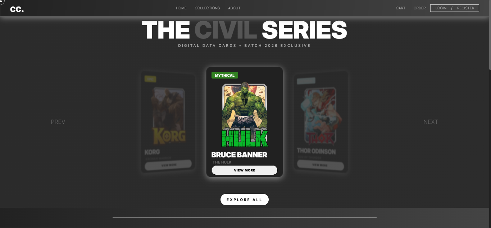
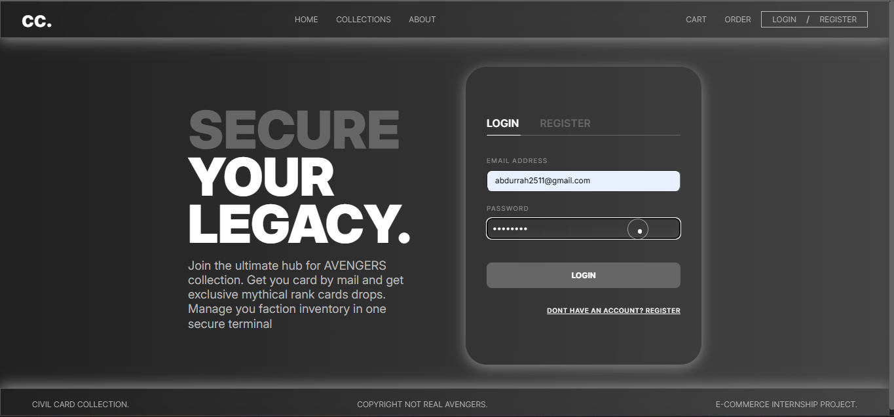
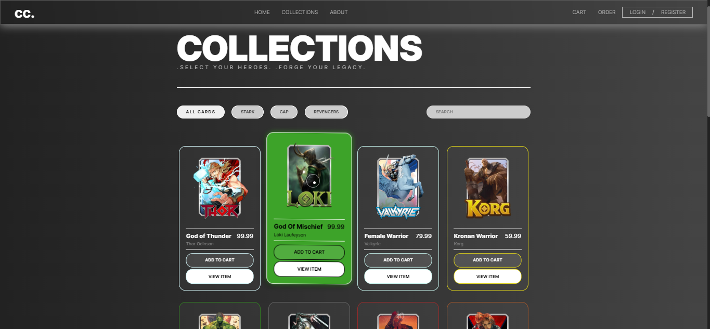
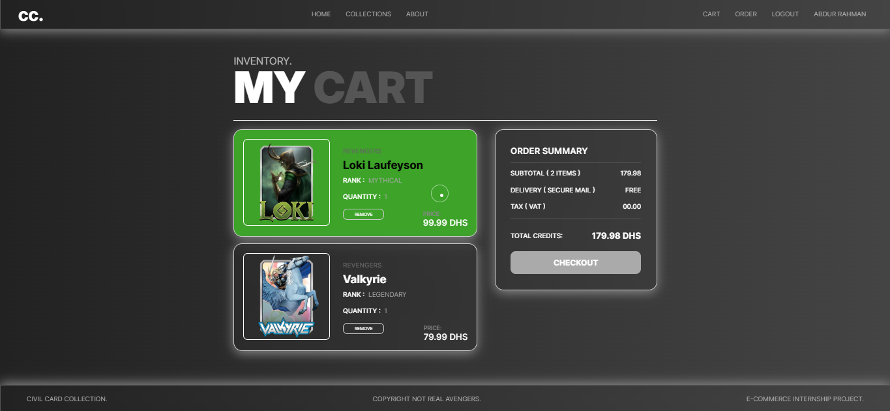
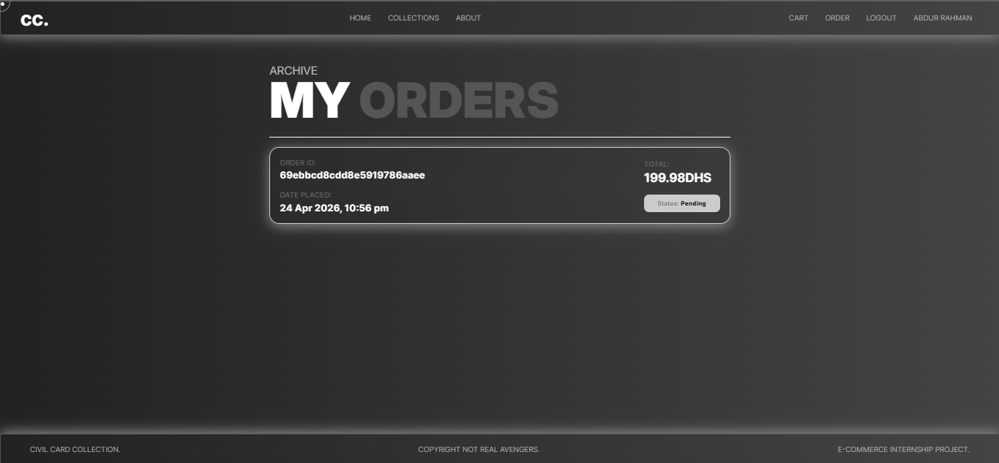

# 🦸 Civil Card – Avengers eCommerce Website

A full-stack Avengers-themed card marketplace where users can browse, collect, and order their favorite hero cards.

---

## 🚀 Live Demo

- 🌐 Frontend: https://your-frontend-url  
- ⚙️ Backend API: https://your-backend-url/api/products  

---

## ✨ Features

### 👤 Authentication
- User Registration & Login
- JWT-based authentication
- Protected routes

### 🛍️ Products
- View all cards
- Product details page
- Category filtering (Stark, Captain, Revengers)
- Search functionality

### 🛒 Cart System
- Add to cart
- Update quantity
- Remove items
- Persistent cart (localStorage)

### 📦 Orders
- Place order (protected)
- View order history
- Order details page
- Shows date & time

### 🎨 UI Features
- Hero carousel
- Shop by team section
- Featured products
- Product badges (Rare, Legendary)
- Responsive grid layout

---

## 🛠️ Tech Stack

### Frontend
- HTML
- CSS
- JavaScript (Vanilla)

### Backend
- Node.js
- Express.js

### Database
- MongoDB (Atlas)

### Deployment
- Frontend: Netlify / Vercel
- Backend: Render

---

## 📂 Project Structure

civil-card/
│
├── backend/
│ ├── defaults/
│ ├── middleware/
│ ├── models/
│ ├── routes/
│ └── server.js
│
├── frontend/
│ ├── js/
│ ├── css/
│ ├── pages/
│ └──index.html
│
└── README.md

---

## ⚙️ Environment Variables

Create a `.env` file in backend:

MONGO_URI=mongodb://127.0.0.1:27017/civil-card
JWT_SECRET=civil_card_super_secret_key
PORT=5000

---

#### 🧪 How to Run Locally

### 🔧 Backend

cd backend
npm install
npm run dev

### 🌐 Frontend

Open `index.html` in browser  
(or use Live Server)

---

## 📸 Screenshots

### 🏠 Home Page

### 🃏 Authentication Page

### 🃏 Collections Page

### 🛒 Cart Page

### 📦 Orders Page

---

## 🔮 Future Improvements

- Payment integration (Stripe)
- Admin dashboard
- Product reviews & ratings
- Image upload (Cloudinary)
- Order status tracking

---

## 🧠 What I Learned

- Full-stack development
- JWT authentication
- REST APIs
- Deployment (Render + Netlify)
- Debugging real-world issues

---

## 📬 Contact

If you like this project or want to collaborate:

- GitHub: https://github.com/github.com/abdurrah2511

---

## ⭐ Give a Star

If you found this helpful, please give this repo a ⭐